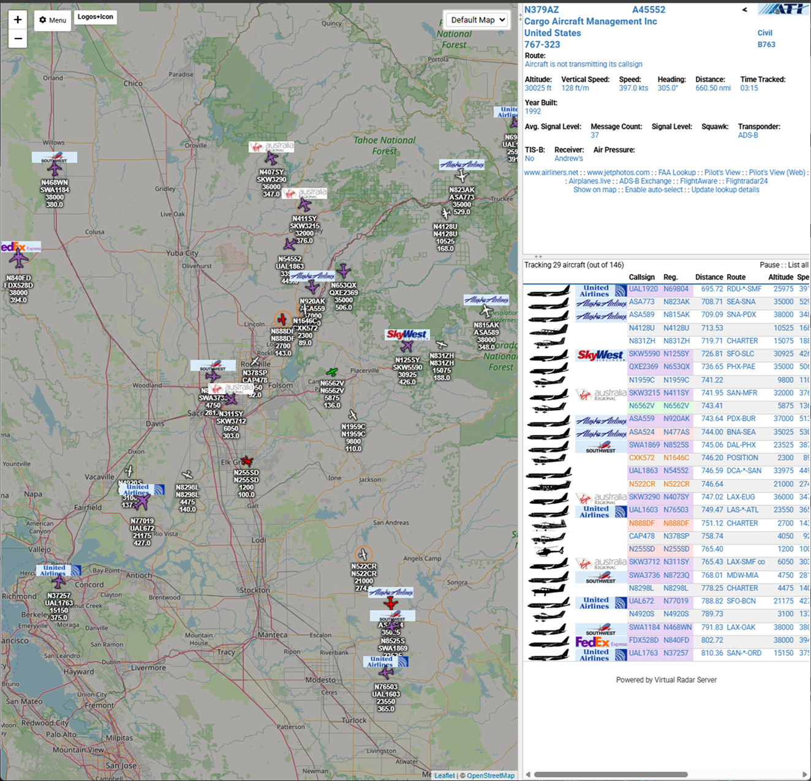
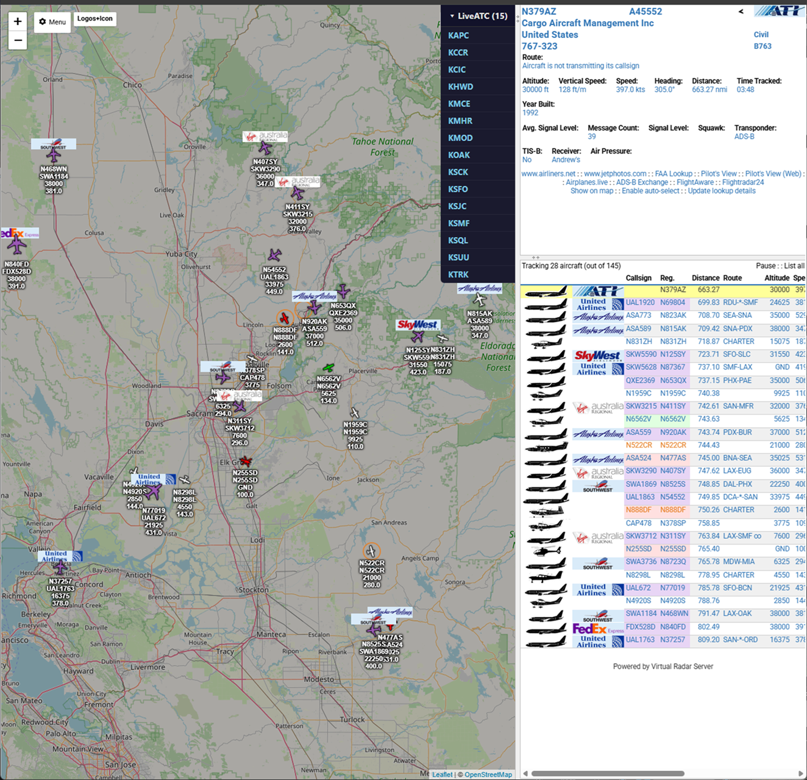
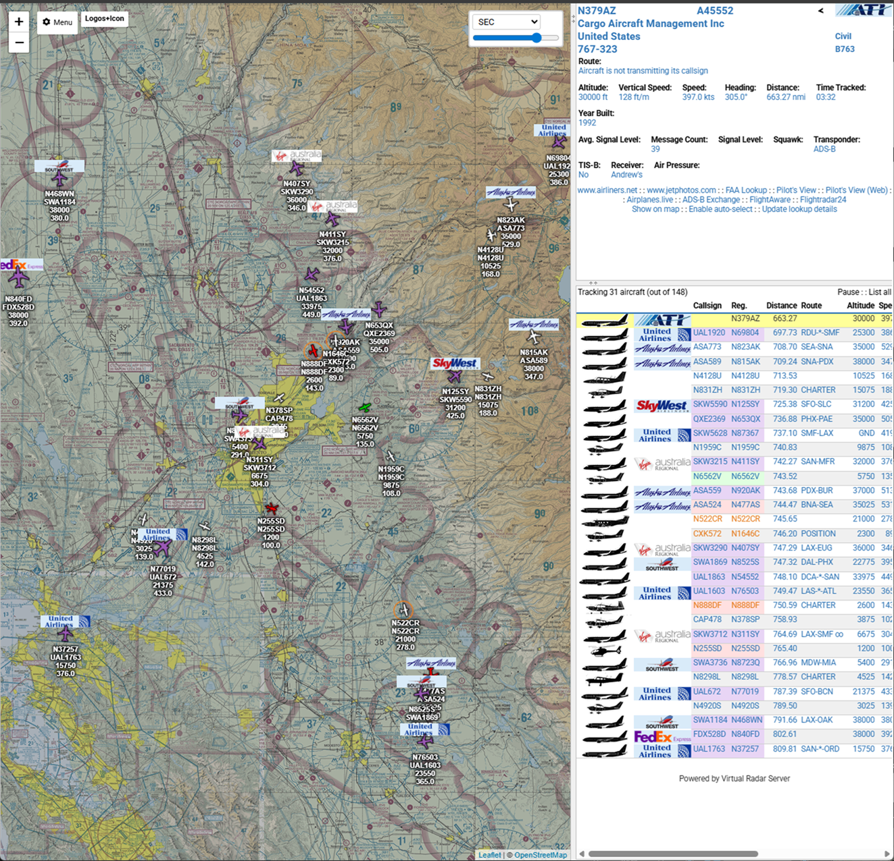
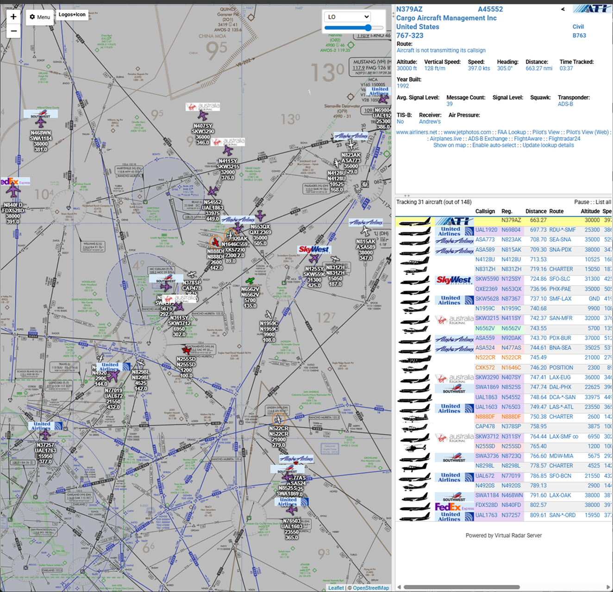
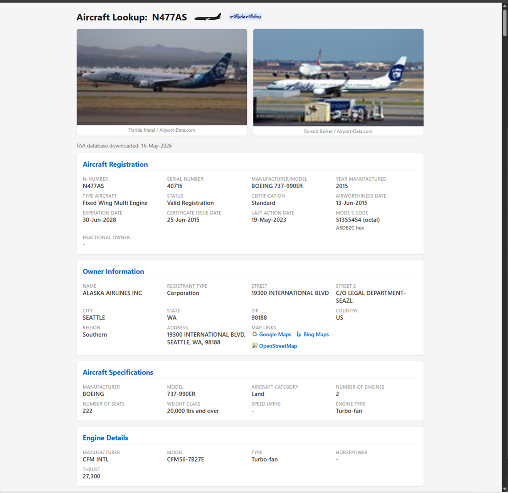
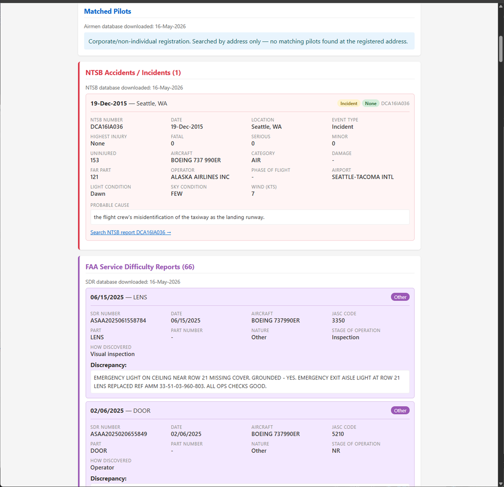

# Virtual Radar Server Plugins

A collection of plugins for [Virtual Radar Server](http://www.virtualradarserver.co.uk/) 3.x, targeting both the Windows (.NET Framework 4.8 / System.Data.SQLite) and Mono / Raspberry Pi (Mono.Data.Sqlite) builds.

## Plugins

### CustomLinks

> Adds user-configurable links to the aircraft detail panel in the VRS web UI. Each link is a template that substitutes fields like ICAO, registration, callsign, or operator code, so you can wire in external lookup sites (photo databases, registries, flight trackers, etc.) and have them open pre-populated for the selected aircraft.

### LiveATC

> Lets you double-click near an airport on the map to open its [LiveATC.net](https://www.liveatc.net/) page in a new browser tab. The plugin ships with an airport database and matches the click location to the nearest airport with LiveATC coverage.

### LogoMarkers

> Replaces the default aircraft SVG icons on the map with composite markers that combine the operator's logo and a heading arrow, rendered server-side. Useful when you'd rather identify aircraft by airline branding than by silhouette.

### PilotsView

> Provides a Google Earth "pilot's view" KML feed that follows a selected aircraft from a chase-camera perspective. Uses a background-sampled position queue (one snapshot per second per tracked aircraft) so the camera always animates between two real samples, avoiding the prediction stalls that break Google Earth's `onStop` callback.

### RegistrationData

> Adds a per-aircraft lookup page to VRS plus configurable highlighting in the aircraft list, all backed by an embedded SQLite database that the plugin downloads and refreshes on a schedule from public sources.  **Requires network access for first use to download databases.** Later database updates also require network access. **Note:  When this plugin first starts, it will immediately begin downloading the databases and processing them.  This will spike the cpu usage and can take an hour to complete on a Pi 3.**
>
> **Data sources** (each independently scheduled and updatable):
>
> - **FAA Aircraft** (US) — registry, model reference, engine reference
> - **FAA Airmen** (US) — pilot certificates and ratings (used for pilot matching)
> - **FAA SDR** — Service Difficulty Reports (maintenance defects / incidents)
> - **NTSB** — US accident & incident database (read from the published Access `.mdb`)
> - **CCAR** (Canada) — Transport Canada Civil Aircraft Register and owners table
> - **CASA** (Australia) — Civil Aviation Safety Authority register
> - **NZCAA** (New Zealand) — Civil Aviation Authority register
>
> **Aircraft lookup page** (opens from the aircraft detail view, optionally in a new tab):
>
> - Registration, owner, make/model, engine, weight (lbs or kg)
> - Photo grid with optional DuckDuckGo image fallback
> - Silhouette and operator logo
> - Pilot matches against FAA airmen by owner name and address, with fuzzy / Levenshtein matching, configurable distance threshold, optional state filtering, and confidence badges (exact / close / possible)
> - NTSB history and SDR reports for the registration
>
> **Aircraft list integration:**
>
> - Row / cell highlighting with a configurable priority order across multiple signals: a user-maintained "pink" registration list, model-ICAO highlights, pilot-matched aircraft, NTSB-flagged aircraft, and SDR-flagged aircraft
> - LADD (Limiting Aircraft Data Displayed) indicator with its own colour, for US aircraft on the FAA's privacy list
> - Toggles for which signals contribute colour, and whether colour is applied to the whole row or only the reg / callsign columns
>
> **Operations:**
>
> - Per-source update intervals (days) and last-download timestamps
> - Custom override URLs per source in case official download locations change
> - Manual "download now" buttons per source in the options dialog

### SnapToOwnship

> Adds a control to the web UI that snaps and centres the map on the configured ownship position. Designed to work alongside the Stratux GPS plugin so you can re-centre on your aircraft with one click after panning around.

### Stratux GPS

> Connects to a [Stratux](http://stratux.me/) ADS-B receiver over the local network, polls its GPS situation feed for ownship position, and uses it as the current location in Virtual Radar Server. Lets VRS automatically track your own aircraft when running in-flight on a tablet or Pi.

### TileServerMBTiles

> Serves map tiles to the VRS web UI from local [`.mbtiles`](https://github.com/mapbox/mbtiles-spec) files, so the map works offline or with self-hosted tile sources (FAA sectional / IFR low / IFR high charts, custom basemaps, etc.). Drop one or more `.mbtiles` files into a folder, point the plugin at it, and each file appears as a selectable base map with an opacity slider.

## Installation

Pre-built deployment archives are tracked in this repository — one `<Name>.zip` per plugin at the repo root. Each archive contains a single top-level folder named after the plugin (e.g. `TileServerMBTiles/`), holding the plugin DLL, its manifest XML, and any `Web/` assets.

The plugins are AnyCPU .NET Framework 4.8 assemblies, so the same archive installs on both 32-bit and 64-bit Windows VRS and on Mono (Raspberry Pi, other Linux).

### Windows installation

1. **Locate VRS's `Plugins` folder.** On a default install this is `C:\Program Files\VirtualRadar Server\Plugins\` (alongside `VirtualRadar.exe`). If you're not sure, open VRS → **Tools → Plugins**; the dialog shows the folder it scans.
2. **Extract the zip** (e.g. `TileServerMBTiles.zip`) into that `Plugins\` folder. The archive's top-level folder lands directly under `Plugins\`, so you should end up with e.g. `Plugins\TileServerMBTiles\VirtualRadar.Plugin.TileServerMBTiles.dll`.
3. **Restart Virtual Radar Server.**
4. Open **Tools → Plugins** again — the new plugin should be listed. Click **Options** to configure it.

To update a plugin, stop VRS, delete the existing `Plugins\<Name>\` folder, extract the new zip, and start VRS again.

### Mono / Raspberry Pi installation

On a typical Pi VRS install the plugins folder is `~/VirtualRadar/Plugins/` (or wherever your VRS lives). Confirm by checking the VRS log on startup, which prints the plugin folder it scans.

1. **Copy the zip to the Pi:**

   ```sh
   scp TileServerMBTiles.zip pi@stratux:~/
   ```

2. **Extract it into VRS's `Plugins/` folder.** Install `unzip` first if it isn't present (`sudo apt install unzip`):

   ```sh
   cd ~/VirtualRadar/Plugins/
   unzip ~/TileServerMBTiles.zip
   ```

   You should end up with e.g. `~/VirtualRadar/Plugins/TileServerMBTiles/VirtualRadar.Plugin.TileServerMBTiles.dll`.

3. **Restart Virtual Radar Server** — `sudo systemctl restart virtualradar`, or however your install starts it.

#### Plugin-specific Mono prerequisites

Most plugins have no extra package requirements on Mono — they just need a working VRS install. A few do:

- **RegistrationData** needs two things on Mono:

  1. **TLS root certificates** so the HTTPS registry downloads (FAA, CCAR, CASA, NZCAA, NTSB, SDR) succeed. Mono on Linux validates server certs against its own trust store rather than `/etc/ssl/certs/`, and on a fresh Pi that store is usually empty or stale — every download fails at the TLS handshake (typically `SecureChannelFailure` or "The authentication or decryption has failed") until you populate it:

     ```sh
     # Refresh the OS CA bundle
     sudo apt-get update
     sudo apt-get install --reinstall ca-certificates
     sudo update-ca-certificates

     # Push it into Mono's machine-wide trust store
     sudo cert-sync /etc/ssl/certs/ca-certificates.crt

     # Also push it into the per-user store for the user that runs VRS
     # (run AS that user, e.g. `pi`, without sudo)
     cert-sync --user /etc/ssl/certs/ca-certificates.crt
     ```

     Restart VRS after running these — Mono reads the trust store at process startup.

  2. **`mdbtools`** for NTSB. The NTSB accident database is published as a Microsoft Access `.mdb` file; on Mono the plugin shells out to `mdb-export`:

     ```sh
     sudo apt install mdbtools
     ```

     If you skip this, all other RegistrationData features (FAA, CCAR, CASA, NZCAA, pilot matching) still work — only NTSB lookups will fail.

- **RegistrationData** users should also use [E's VRS Database Updater](https://github.com/egite/E-s-VRS-Database-Updater) to create a full database of aircraft rather than using VRS' default.

- **TileServerMBTiles** — the overzoom feature (rendering tiles beyond an `.mbtiles` file's stored maximum zoom) uses `System.Drawing.Bitmap`, which on Mono needs libgdiplus:

  ```sh
  sudo apt install libgdiplus
  ```

  Tile serving at native zoom levels works fine without it — install only if you want to zoom in past a chart's intended scale.

- **Stratux GPS** — needs network access from the Pi running VRS to the Stratux device's HTTP situation feed (default `http://192.168.10.1/getSituation`).

## Building from source

Each plugin builds as a single .NET Framework 4.8 DLL. Requirements:

- Visual Studio 2015 or later, **or** Build Tools for Visual Studio (any edition with the .NET desktop workload).
- A local copy of Virtual Radar Server 3.x for the referenced `VirtualRadar.Interface.dll` / `VirtualRadar.Localisation.dll` / `VirtualRadar.WinForms.dll`. The csproj files reference them via `..\Plugin.CustomLinks\bin\Debug\` — drop those three DLLs from your VRS install into `Plugin.CustomLinks\bin\Debug\` before the first build, or edit the `<HintPath>` entries.

Per-plugin build scripts are in the repo root:

```
build-CustomLinks.bat
build-LiveATC.bat
build-LogoMarkers.bat
build-PilotsView.bat
build-RegistrationData.bat
build-SnapToOwnship.bat
build-StratuxGPS.bat
build-TileServerMBTiles.bat
```

Each one calls `_build-plugin.bat`, which locates MSBuild (via `vswhere`, with explicit fallbacks for VS 2017/2019/2022 and standalone MSBuild 14.0) and rebuilds the plugin in the appropriate Debug/Release configuration.

After building, `build-deployment-zips.bat` repackages the freshly built DLLs into the `<Name>.zip` deployment archives in the repo root.

## Authorship

All code in this repository was authored by [Claude Code](https://claude.com/claude-code) (Anthropic), directed and reviewed by the repository owner.

## Screenshots of some of the plugins












